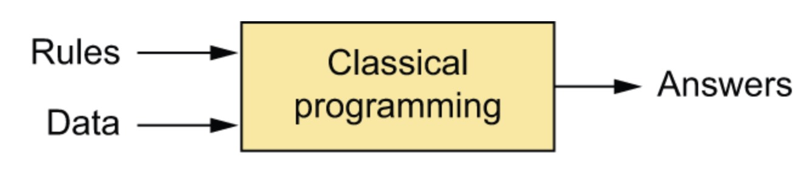
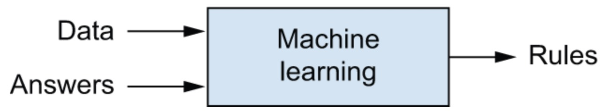
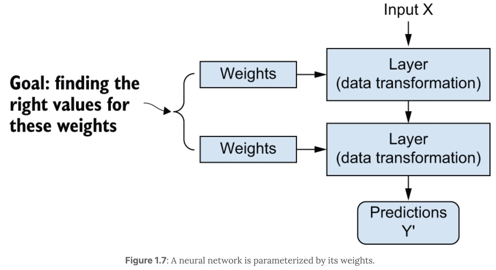
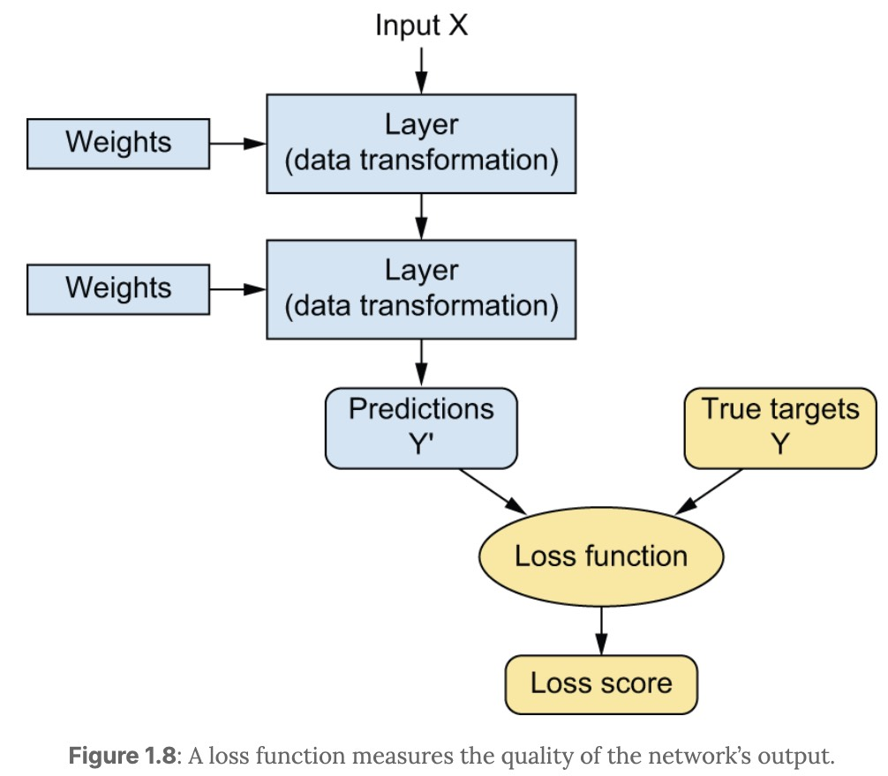
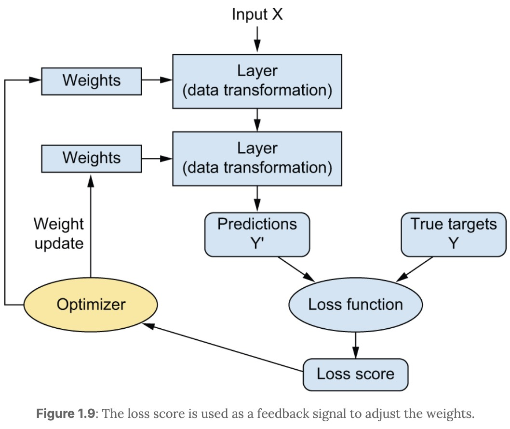
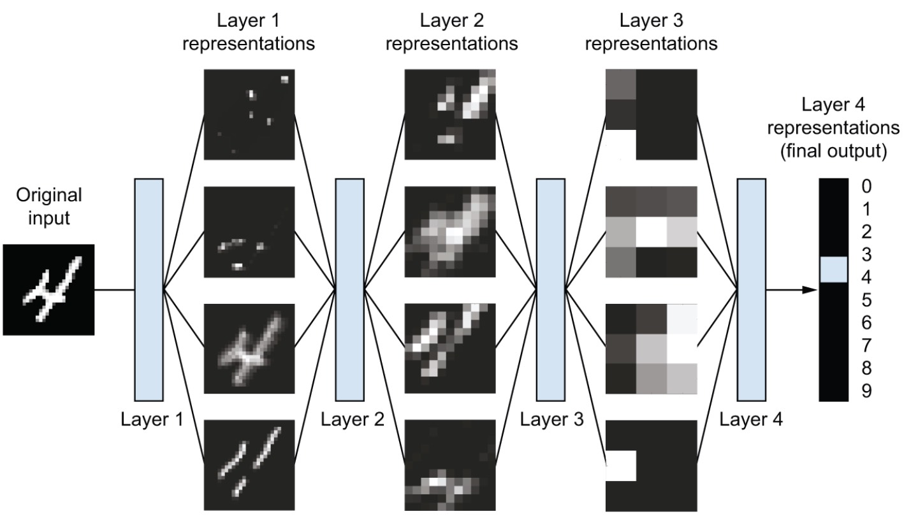

# What is Machine Learning and Deep Learning

---

## 1. From Rules to Learning

Traditional systems rely on predefined logic:

$$
\text{Input} + \text{Rules} \rightarrow \text{Output}
$$

This works only when rules are clear and enumerable.

Machine learning removes this assumption:

$$
\text{Input} + \text{Output} \rightarrow \text{Model}
$$

The system **learns the mapping** instead of being explicitly programmed.

---

## 2. What Does It Mean to Learn

A model is a parameterized function:

$$
\hat{y} = f(x; \theta)
$$

Learning means choosing parameters $\theta$ such that predictions match targets.

This is done by minimizing a loss:

$$
\mathcal{L}(y, \hat{y})
$$

So the problem becomes:

$$
\theta^* = \arg\min_{\theta} \mathcal{L}(y, f(x; \theta))
$$

---

## 3. The Role of Representation

Raw data is not directly useful. Learning requires transforming it:

$$
x \rightarrow h \rightarrow y
$$

A representation $h$ is a new view of the data that makes the task easier.

Machine learning is fundamentally:

> Learning useful representations of data for a given task.

---

## 4. Learning as Composition

Instead of a single transformation, we build a chain:

$$
x \rightarrow h_1 \rightarrow h_2 \rightarrow \dots \rightarrow y
$$

Each step simplifies the problem.

The challenge is to **find these transformations automatically**.

---

## 5. Shallow vs Deep

### Shallow models

* Few transformations
* Strong reliance on manual features

### Deep models

* Many transformations
* Features learned automatically

Depth refers to the number of transformations.

---

## 6. What is Deep Learning

Deep learning is:

> Learning a sequence of representations through stacked transformations.

Formally:

$$
h_{l+1} = f(W_l h_l + b_l)
$$

A deep model is a composition:

$$
f(x) = f_L \circ f_{L-1} \circ \dots \circ f_1(x)
$$
