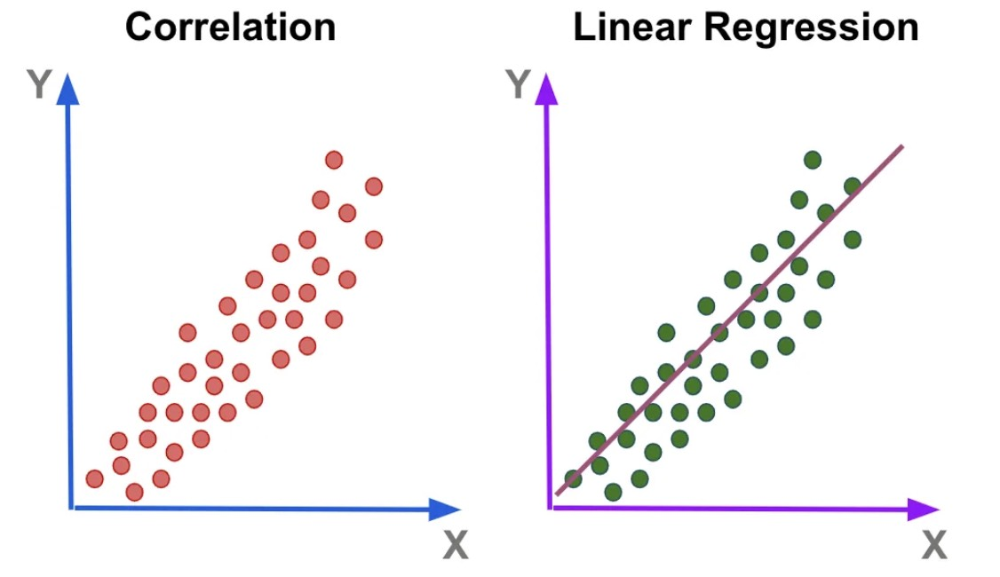
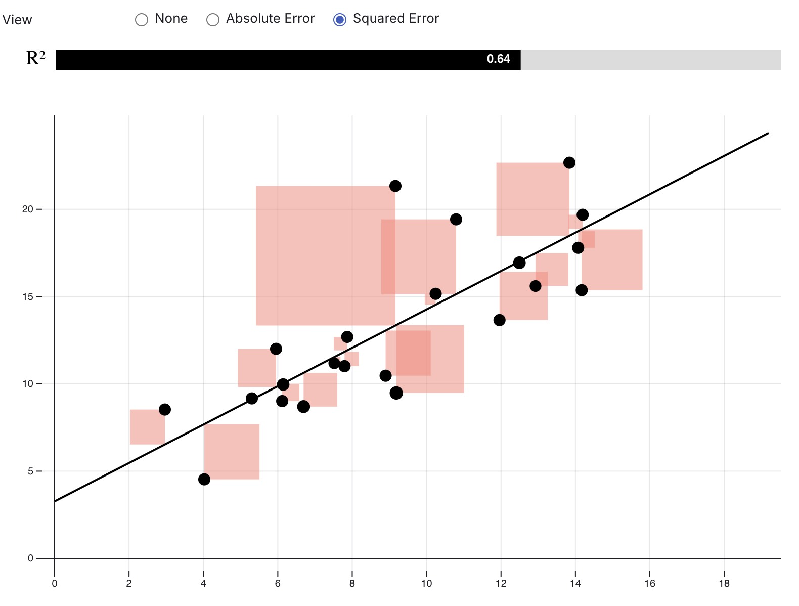
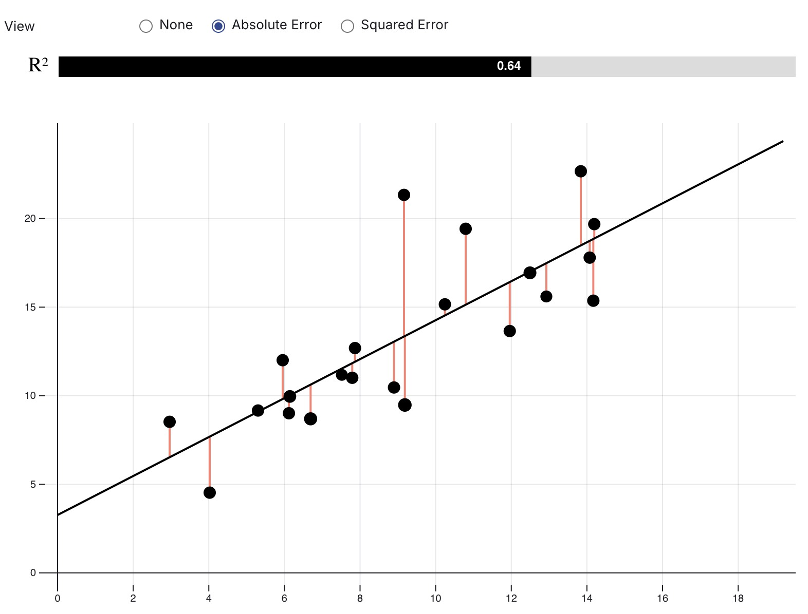

# Linear Regression

---

# 1. What is Linear Regression

- https://observablehq.com/@yizhe-ang/interactive-visualization-of-linear-regression

Linear regression is a method to **predict a target variable using input features**.

It assumes a **linear relationship** between input $x$ and output $y$:

$$
y \approx \hat{y} = w x + b
$$

where:

* $w$ = slope
* $b$ = intercept

The model predicts $\hat{y}$ for a given $x$.

The goal is to find $w$ and $b$ that **fit the data well**.

---

# 2. Problem Setup

We have a dataset with $n$ samples:

$$
\{(x^{(i)}, y^{(i)})\}_{i=1}^n
$$

Each $x^{(i)}$ is a feature and $y^{(i)}$ is the target.

The model predicts:

$$
\hat{y}^{(i)} = w x^{(i)} + b
$$

We want $w$ and $b$ that **minimize the difference** between $\hat{y}^{(i)}$ and $y^{(i)}$.

---

# 3. Measuring the Error

We use a **loss function** to measure prediction error.

One common choice is **Mean Squared Error (MSE)**:

$$
\mathcal{L}(w, b) = \frac{1}{n} \sum_{i=1}^n (\hat{y}^{(i)} - y^{(i)})^2
$$

Minimizing this loss gives the **best-fitting line**.
