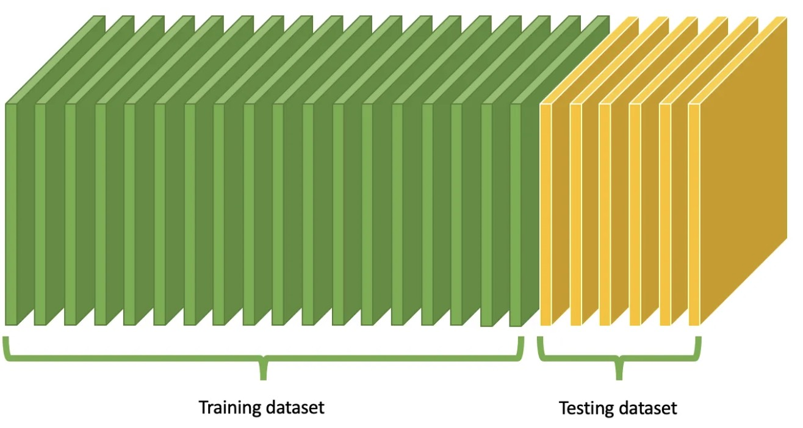
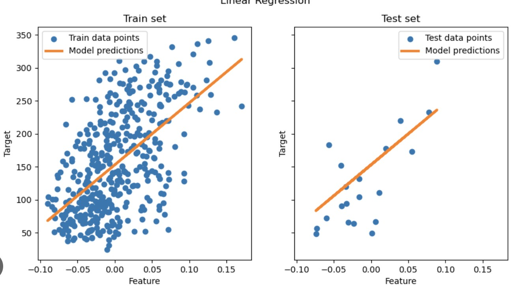

# Train / Test Splitting

---

# 1. Why Do We Need a Split

So far, we trained models on a dataset.

But how do we know if the model is **good**?

If we evaluate on the same data used for training:

* the model may **memorize the data**
* the error may look **artificially low**

This does not reflect real performance.

We need a way to measure **generalization**.

---

# 2. Core Idea

We split the dataset into two parts:

* **Training set** – used to learn parameters
* **Test set** – used to evaluate performance

The model never sees the test set during training.

---

# 3. Notation

Original dataset:

$$
\{(x^{(i)}, y^{(i)})\}_{i=1}^n
$$

Split into:

* training set: $\{(x^{(i)}, y^{(i)})\}_{i \in \mathcal{T}}$
* test set: $\{(x^{(i)}, y^{(i)})\}_{i \in \mathcal{S}}$

where:

$$
\mathcal{T} \cap \mathcal{S} = \emptyset
$$

---

# 4. Typical Split Ratios

Common choices:

* 70% training / 30% test
* 80% training / 20% test

More data in training helps learning.

Enough data in test helps reliable evaluation.

---

# 5. Training vs Testing

Training phase:

* model learns parameters $w, b$
* uses only training data

Testing phase:

* compute predictions on test data
* measure error using MSE or other metrics

This gives a **fair estimate of performance**.

---

# 6. Important Details

### Random Split

The split should be random.

This avoids bias in training and testing.

### No Data Leakage

Test data must not be used during training.

Do not:

* tune parameters using test data
* normalize using full dataset

Always use **training data only** for learning steps.

---

# 7. Beyond Train/Test (later sessions)

We can introduce a **validation set**:

* training set → learn parameters
* validation set → tune hyperparameters
* test set → final evaluation
