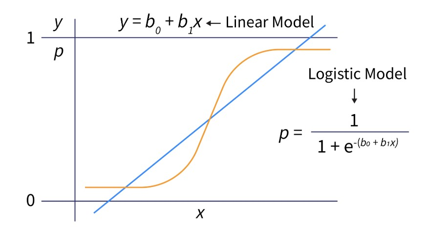
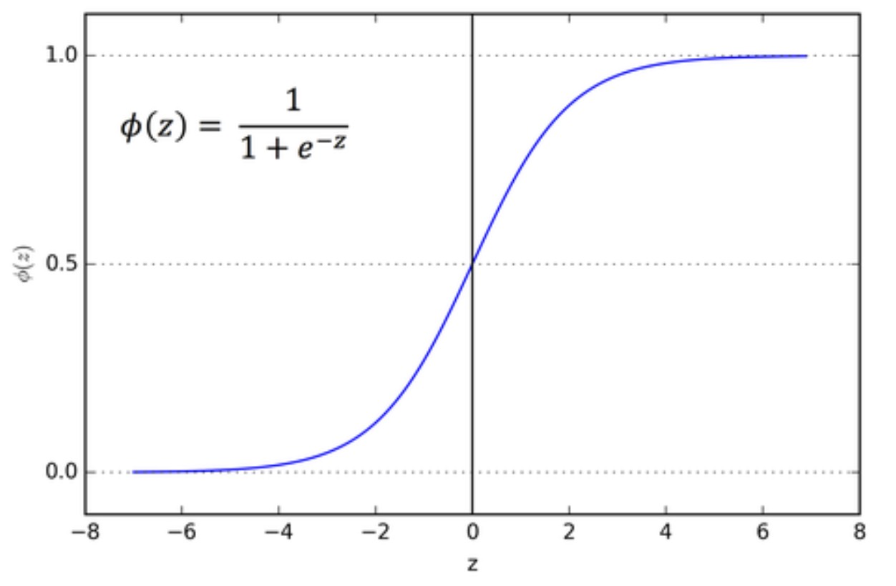
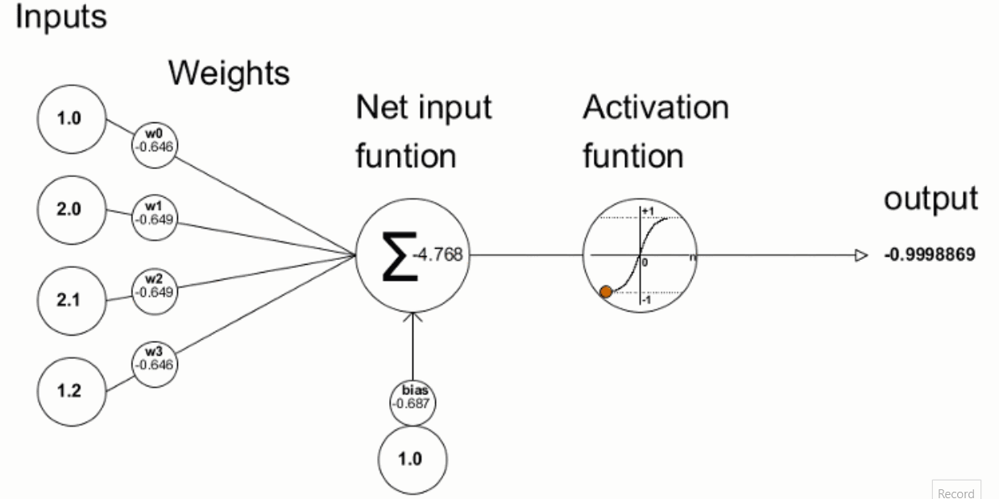
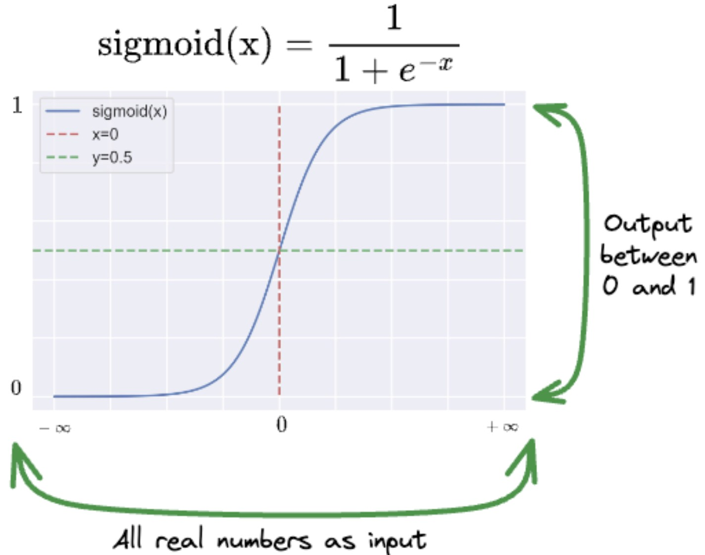

# The Sigmoid Model

---

## 1. The missing piece

From the previous lecture, we have:

$$
z = x W + b
$$

where $x \in \mathbb{R}^{1 \times d}$ is a row vector, $W \in \mathbb{R}^{d \times 1}$ is a weight matrix, and $b \in \mathbb{R}^{1 \times 1}$ is the bias (scalar as row vector).

But this is still:

$$
z \in (-\infty, +\infty)
$$

We need:

$$
\hat{y} \in [0, 1]
$$

So the question becomes:

> How do we convert $z$ into a valid probability?

---

## 2. The sigmoid function

We introduce a function:

$$
\boxed{\sigma(z) = \frac{1}{1 + e^{-z}}}
$$

This is called the sigmoid function.

---

## 3. Why sigmoid?

The sigmoid function has exactly the properties we need.

### Bounded output

$$
\sigma(z) \in (0, 1)
$$

No matter what $z$ is, the output is always a valid probability.

---

### Smooth and differentiable

The function is continuous and smooth everywhere.

This makes it suitable for gradient-based optimization.

---

### Monotonic

If $z_1 > z_2$, then:

$$
\sigma(z_1) > \sigma(z_2)
$$

So ordering is preserved.

---

### Key values

$$
\sigma(0) = 0.5
$$

* Negative $z$ → output close to 0
* Positive $z$ → output close to 1

---

## 4. The logistic regression model

Now we combine everything.

First compute:

$$
z = x W + b
$$

Then apply sigmoid:

$$
\hat{y} = \sigma(z)
$$

So the full model is:

$$
\hat{y} = \sigma(x W + b)
$$

---

## 5. Interpretation

The output now has a clear meaning:

$$
\hat{y} = \text{probability that } y = 1
$$

This gives:

* A value between 0 and 1
* A notion of confidence
* A smooth transition between classes

---

## 6. Derivatives (A Quick Refresher)

To understand gradient descent in logistic regression, we need derivatives. Here are the essentials:

### Common derivatives

| Function | Derivative |
|----------|------------|
| $f(x) = x^2$ | $f'(x) = 2x$ |
| $f(x) = \ln(x)$ | $f'(x) = \frac{1}{x}$ |
| $f(x) = e^x$ | $f'(x) = e^x$ |
| $f(x) = \frac{1}{x}$ | $f'(x) = -\frac{1}{x^2}$ |

Chain rule: if $f(x) = g(h(x))$, then $f'(x) = g'(h(x)) \cdot h'(x)$.

### The Beautiful Sigmoid Derivative

Here is where the sigmoid reveals its mathematical elegance. The derivative has a remarkable property that makes gradient descent work beautifully.

### The result

$$
\boxed{\frac{\partial \sigma(z)}{\partial z} = \sigma(z)(1 - \sigma(z))}
$$

This means: **the derivative can be expressed purely in terms of the function's own output**. No $z$ appears explicitly on the right side.

### Why this is powerful

Let $\hat{y} = \sigma(z)$. Then:

$$
\frac{\partial \hat{y}}{\partial z} = \hat{y}(1 - \hat{y})
$$

This has deep implications:

* At extreme values ($\hat{y} \approx 0$ or $\hat{y} \approx 1$), the derivative approaches zero—reflecting that the sigmoid "saturates"
* At the decision boundary ($\hat{y} = 0.5$), the derivative is maximized at $0.25$
* The gradient naturally adapts: uncertain predictions yield stronger gradients

### The derivation (optional, step by step)

Starting with:

$$
\sigma(z) = \frac{1}{1 + e^{-z}} = (1 + e^{-z})^{-1}
$$

Apply the chain rule. Let $u = 1 + e^{-z}$, so $\sigma = u^{-1}$:

**Step 1:** Derivative of outer function

$$
\frac{\partial \sigma}{\partial u} = -u^{-2} = -\frac{1}{(1 + e^{-z})^2}
$$

**Step 2:** Derivative of inner function

$$
\frac{\partial u}{\partial z} = \frac{\partial}{\partial z}(1 + e^{-z}) = -e^{-z}
$$

**Step 3:** Multiply by chain rule

$$
\frac{\partial \sigma}{\partial z} = \frac{\partial \sigma}{\partial u} \cdot \frac{\partial u}{\partial z} = -\frac{1}{(1 + e^{-z})^2} \cdot (-e^{-z}) = \frac{e^{-z}}{(1 + e^{-z})^2}
$$

**Step 4:** The algebraic trick

Add and subtract 1 in the numerator to create a perfect match:

$$
\frac{\partial \sigma}{\partial z} = \frac{e^{-z}}{(1 + e^{-z})^2} = \frac{(1 + e^{-z}) - 1}{(1 + e^{-z})^2} = \frac{1}{1 + e^{-z}} \cdot \frac{(1 + e^{-z}) - 1}{1 + e^{-z}}
$$

**Step 5:** Recognize the sigmoid

$$
\frac{\partial \sigma}{\partial z} = \sigma(z) \cdot \left(1 - \frac{1}{1 + e^{-z}}\right) = \sigma(z)(1 - \sigma(z))
$$
