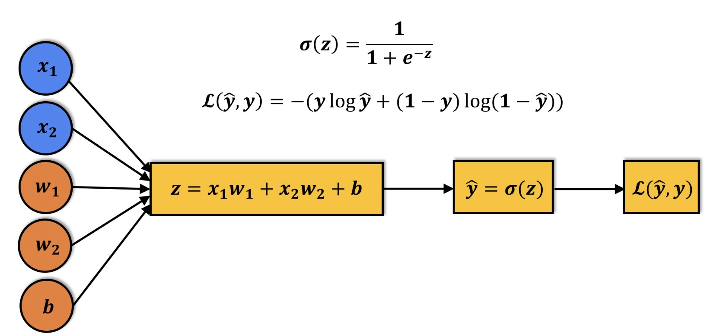
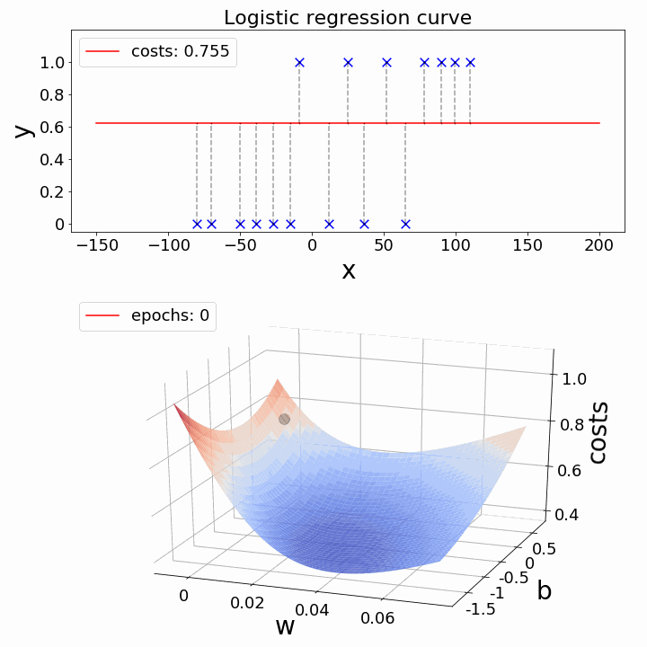

# Loss Function and Gradient Descent in Logistic Regression

---

## 1. Objective

We have a logistic regression model:

$$
\hat{y} = \sigma(z) = \sigma(x W + b)
$$

where $x \in \mathbb{R}^{1 \times d}$ is the feature row vector, $W \in \mathbb{R}^{d \times 1}$ is the weight matrix, $b \in \mathbb{R}^{1 \times 1}$ is the bias (scalar as row vector), and $\sigma$ is the sigmoid function:

$$
\sigma(z) = \frac{1}{1 + e^{-z}}
$$

The true label is binary:

$$
y \in \{0, 1\}
$$

Our goal is to **adjust $W$ and $b$ such that predicted probabilities $\hat{y}$ match the true labels $y$** as closely as possible across all samples.

This raises two key questions:

1. **How do we measure the error of a probability prediction?**
2. **How do we adjust the parameters to reduce that error?**

---

## 2. Why not Mean Squared Error?

A naive idea is to use the same loss as in linear regression:

$$
\mathcal{L}_\text{MSE} = \frac{1}{n} \sum_{i=1}^{n} (\hat{y}^{(i)} - y^{(i)})^2
$$

At first glance, this seems reasonable: $\hat{y}$ is a number, $y$ is a number, just take the squared difference.

However, MSE is **not suitable for probabilities**. Here's why:

### 2.1 Poor feedback for wrong predictions

Let's derive the gradient of MSE w.r.t. the pre-activation $z$ to understand why the feedback is weak.

**MSE loss for a single sample:**

$$
\mathcal{L} = (\hat{y} - y)^2
$$

Since the prediction passes through the sigmoid activation:

$$
\hat{y} = \sigma(z)
$$

By the chain rule, the gradient w.r.t. $z$ is:

$$
\frac{\partial \mathcal{L}}{\partial z} = \frac{\partial \mathcal{L}}{\partial \hat{y}} \cdot \frac{\partial \hat{y}}{\partial z}
$$

**Step 1: Gradient of loss w.r.t. prediction**

$$
\frac{\partial \mathcal{L}}{\partial \hat{y}} = 2(\hat{y} - y)
$$

**Step 2: Gradient of sigmoid w.r.t. pre-activation**

The sigmoid derivative is:

$$
\frac{\partial \hat{y}}{\partial z} = \frac{\partial \sigma(z)}{\partial z} = \sigma(z)(1 - \sigma(z)) = \hat{y}(1 - \hat{y})
$$

**Final: Combined gradient**

$$
\boxed{\frac{\partial \mathcal{L}}{\partial z} = 2(\hat{y} - y) \hat{y}(1 - \hat{y})}
$$

**Example:**

* True label $y = 1$
* Prediction $\hat{y} = 0.01$

The MSE loss is:

$$
\mathcal{L} = (\hat{y} - y)^2 = (0.01 - 1)^2 = 0.9801
$$

The gradient w.r.t. $z$ is:

$$
\frac{\partial \mathcal{L}}{\partial z} = 2(\hat{y} - y) \hat{y}(1 - \hat{y}) = 2(-0.99)(0.01 \times 0.99) \approx -0.0196
$$

Notice how **the correction signal is tiny** ($\approx -0.02$) despite being a huge mistake (loss $\approx 0.98$; true label 1 while prediction is 0.01). This is because the sigmoid derivative $\hat{y}(1 - \hat{y})$ becomes very small when $\hat{y}$ is near 0 or 1, causing the gradient to vanish and slowing down learning drastically.

### 2.2 Ignores probability semantics (optional)

MSE treats $\hat{y}$ as a raw number. But $\hat{y}$ is a **probability**. We want a loss function that:

* Penalizes confident mistakes heavily
* Provides a strong gradient signal
* Aligns with probability theory

---

## 3. Binary Cross Entropy (BCE)

The natural choice is **Binary Cross Entropy (BCE)**:

$$
\boxed{\mathcal{L}_\text{BCE} = - \frac{1}{n} \sum_{i=1}^{n} \big( y^{(i)} \log \hat{y}^{(i)} + (1-y^{(i)}) \log (1 - \hat{y}^{(i)}) \big)}
$$

> **Note:** Here $\log$ denotes the natural logarithm $\ln$ (logarithm base $e$).

**Intuition:**

* If $y^{(i)} = 1$, the first term $- \log \hat{y}^{(i)}$ dominates
* If $y^{(i)} = 0$, the second term $- \log (1 - \hat{y}^{(i)})$ dominates
* Predictions close to the true label → small loss
* Confident mistakes → very large loss

---

### 3.1 Behavior of BCE

Comparison with MSE:

| True $$y$$ | Predicted $$\hat{y}$$ | BCE Loss | MSE Loss |
| -------- | ------------------- | -------- | -------- |
| 1        | 0.9                 | 0.105    | 0.01     |
| 1        | 0.5                 | 0.693    | 0.25     |
| 1        | 0.01                | 4.605    | 0.9801   |
| 0        | 0.9                 | 2.303    | 0.81     |
| 0        | 0.5                 | 0.693    | 0.25     |
| 0        | 0.01                | 0.010    | 0.0001   |

Notice how **BCE penalizes wrong confident predictions sharply**, giving strong gradient signals for learning.

---

## 4. Gradient of BCE

For a single sample, the per-example BCE loss is:

$$
\ell^{(i)} = - \big( y^{(i)} \log \hat{y}^{(i)} + (1-y^{(i)})\log(1-\hat{y}^{(i)}) \big)
$$

Gradient w.r.t $z^{(i)}$ (pre-activation):

$$
\frac{\partial \ell^{(i)}}{\partial z^{(i)}} = \hat{y}^{(i)} - y^{(i)}
$$

**Remark:** This is extremely elegant:

* Directly the difference between predicted probability and true label
* Avoids vanishing gradients
* Works naturally with the sigmoid function

---

### 4.1 Gradient w.r.t weights and bias

Since $z = x W + b$:

* Gradient w.r.t weights (per-example):

$$
\frac{\partial \ell^{(i)}}{\partial W} = x^{(i)\mathsf{T}} (\hat{y}^{(i)} - y^{(i)})
$$

For the full batch:

$$
\frac{\partial \mathcal{L}}{\partial W} = \frac{1}{n} \sum_{i=1}^{n} x^{(i)\mathsf{T}} (\hat{y}^{(i)} - y^{(i)})
$$

In matrix form:

$$
\boxed{\frac{\partial \mathcal{L}}{\partial W} = \frac{1}{n} X^{\mathsf{T}} (\hat{Y} - Y)}
$$

* Gradient w.r.t bias (per-example):

$$
\frac{\partial \ell^{(i)}}{\partial b} = \hat{y}^{(i)} - y^{(i)}
$$

For the full batch:

$$
\frac{\partial \mathcal{L}}{\partial b} = \frac{1}{n} \sum_{i=1}^{n} (\hat{y}^{(i)} - y^{(i)})
$$

In matrix form:

$$
\boxed{\frac{\partial \mathcal{L}}{\partial b} = \frac{1}{n} \mathbf{1}^{\mathsf{T}} (\hat{Y} - Y)}
$$

---

### 4.2 Intuition

* $(\hat{y} - y)$ acts as the **error signal**
* Multiplying by $x$ scales the update for each feature
* The parameter update moves in the direction that **reduces the error**

---

## 5. Gradient Descent Updates

For a learning rate $\eta$, batch gradient descent:

$$
\boxed{W \leftarrow W - \eta \frac{\partial \mathcal{L}}{\partial W} = W - \eta \frac{1}{n} X^{\mathsf{T}} (\hat{Y} - Y)}
$$

$$
\boxed{b \leftarrow b - \eta \frac{\partial \mathcal{L}}{\partial b} = b - \eta \frac{1}{n} \sum_{i=1}^{n} (\hat{y}^{(i)} - y^{(i)})}
$$

In batch matrix form (the same structure applies to mini-batch or SGD):

$$
\boxed{W \leftarrow W - \eta \frac{1}{n} X^{\mathsf{T}} (\hat{Y} - Y)}
$$

$$
\boxed{b \leftarrow b - \eta \frac{1}{n} \mathbf{1}^{\mathsf{T}} (\hat{Y} - Y)}
$$

---

## 6. Single-step example

Suppose:

* Feature: $x = [1, 2]$ (row vector, $x \in \mathbb{R}^{1 \times 2}$)
* True label: $y = 1$
* Weight: $W = \begin{bmatrix} 0.5 \\ -0.5 \end{bmatrix}$ (weight matrix, $W \in \mathbb{R}^{2 \times 1}$)
* Bias: $b = 0$

1. Compute pre-activation:

$$
z = x W + b = [1, 2] \begin{bmatrix} 0.5 \\ -0.5 \end{bmatrix} + 0 = 0.5*1 + (-0.5)*2 + 0 = -0.5
$$

2. Compute prediction:

$$
\hat{y} = \sigma(-0.5) \approx 0.38
$$

 3. Compute gradient w.r.t weights:

 $$
 \frac{\partial \mathcal{L}}{\partial W} = x^{\mathsf{T}} (\hat{y}-y) = \begin{bmatrix} 1 \\ 2 \end{bmatrix} (0.38 - 1) = \begin{bmatrix} -0.62 \\ -1.24 \end{bmatrix}
 $$

4. Update weights with learning rate $\eta = 0.1$:

$$
W_\text{new} = W - \eta \frac{\partial \mathcal{L}}{\partial W} = \begin{bmatrix} 0.5 \\ -0.5 \end{bmatrix} - 0.1 \begin{bmatrix} -0.62 \\ -1.24 \end{bmatrix} = \begin{bmatrix} 0.562 \\ -0.376 \end{bmatrix}
$$

5. Update bias:

$$
b_\text{new} = b - \eta (\hat{y}-y) = 0 - 0.1*(0.38 - 1) = 0.062
$$

---

## 7. Training Loop in Practice

1. Forward pass: compute $z = x W + b$ and $\hat{y} = \sigma(z)$
2. Compute BCE loss
3. Backward pass: compute gradients $\partial \mathcal{L} / \partial W$ and $\partial \mathcal{L} / \partial b$
4. Update parameters with gradient descent
5. Repeat for all batches / epochs until convergence

