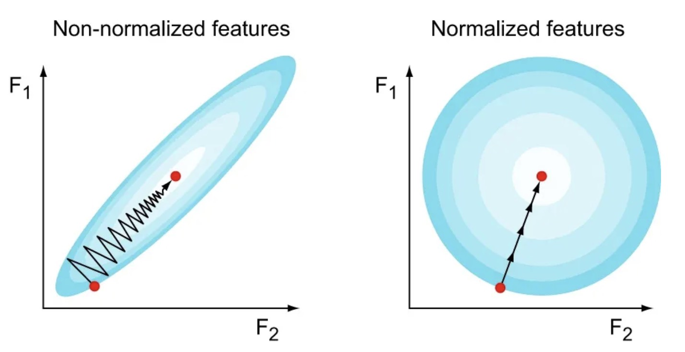
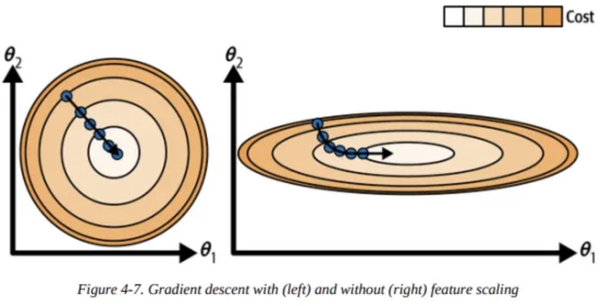

# Feature Scaling

---

## 1. What is feature scaling?

Different features can have very different ranges.

Example:

* Age: $[0, 100]$
* Income: $[0, 100000]$
* Binary feature: ${0, 1}$

These differences create problems for optimization.

---

## 2. Why scale matters

Recall the gradient update:

$$
W \leftarrow W - \eta \frac{\partial \mathcal{L}}{\partial W}
$$

For logistic regression:

$$
\frac{\partial \mathcal{L}}{\partial W} = x^{\mathsf{T}} (\hat{y} - y)
$$

So the update depends directly on $x$.

---

### Key consequence

If one feature has a much larger scale:

* Its corresponding gradient is much larger
* Its weight updates dominate
* Other features are effectively ignored

---

## 3. What goes wrong

### Uneven updates

Large-scale features:

* Cause large gradient steps

Small-scale features:

* Cause tiny updates

This leads to imbalance in learning.

---

## 4. Geometric intuition

Consider the loss surface.

Without feature scaling:

* Contours look like elongated ellipses

$$
\text{narrow in one direction, wide in another}
$$

Gradient descent behavior:

* Oscillates across the narrow direction
* Slowly progresses along the long axis

---

With proper scaling:

* Contours become closer to circles

$$
\text{balanced curvature in all directions}
$$

Gradient descent:

* Moves more directly toward the minimum
* Converges faster

---

## 5. Two common methods

### Normalization

Rescale features to a fixed range, usually $[0, 1]$:

$$
x' = \frac{x - x_{\min}}{x_{\max} - x_{\min}}
$$

Properties:

* Preserves relative ordering
* Bounded output

---

### Standardization

Center and scale using mean and variance:

$$
x' = \frac{x - \mu}{\sigma}
$$

Properties:

* Mean becomes 0
* Standard deviation becomes 1
* Handles different distributions better

---

## 6. Applies beyond logistic regression

This is not specific to logistic regression.

It applies to:

* Linear regression
* Logistic regression
* Neural networks
* Any gradient-based optimization
